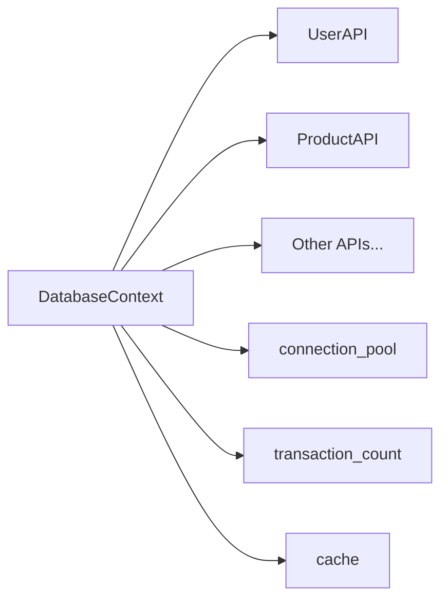

# Database Context Pattern

Refer to /Users/wballard/github/apithing/ideas/start.md

## Goal
Implement the `DatabaseContext` struct that demonstrates shared context usage across API families.

## Tasks
- Create `DatabaseContext` struct with:
  - `connection_pool: String` (simplified for demo)
  - `transaction_count: u32` 
  - `cache: HashMap<String, String>`
- Implement methods:
  - `new(connection: String) -> Self`
  - `increment_transaction(&mut self)`
- Add comprehensive rustdoc documentation
- Add `Debug` derive and other standard traits

## Success Criteria
- Context compiles and provides expected functionality
- Documentation explains the shared context pattern
- Methods work as expected in basic tests

## Architecture Notes
The context pattern allows multiple API families to share state and resources while maintaining type safety. This example uses a database context but the pattern works for any shared resource management.

