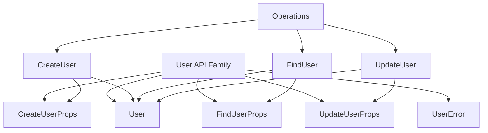

# User API Types and Props

Refer to /Users/wballard/github/apithing/ideas/start.md

## Goal
Create the data types and props structures for the user API family.

## Tasks
- Create `user_api` module
- Define props structs:
  - `CreateUserProps` with `name: String`, `email: String`
  - `FindUserProps` with `user_id: u64`
  - `UpdateUserProps` with `user_id: u64`, `name: Option<String>`, `email: Option<String>`
- Define `User` struct with `id: u64`, `name: String`, `email: String`
- Define `UserError` enum with variants: `NotFound`, `InvalidEmail`, `DatabaseError`
- Add derives: `Debug`, `Clone` for data types, `Debug` for errors
- Add comprehensive rustdoc for all types

## Success Criteria
- All types compile without errors
- Types follow Rust conventions (derive appropriate traits)
- Documentation explains each field and variant
- Types support the operations needed for CRUD operations

## Architecture Notes

These types form the foundation for user-related API operations.