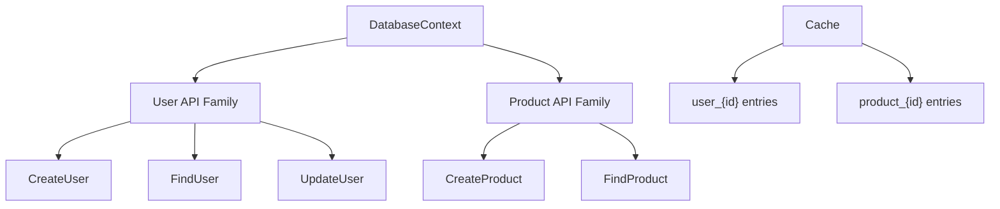

# Product API Types and Props

Refer to /Users/wballard/github/apithing/ideas/start.md

## Goal
Create the data types and props structures for the product API family to demonstrate multi-family API design.

## Tasks
- Create `product_api` module
- Define props structs:
  - `CreateProductProps` with `name: String`, `price: f64`, `category: String`
  - `FindProductProps` with `product_id: u64`
- Define `Product` struct with `id: u64`, `name: String`, `price: f64`, `category: String`
- Define `ProductError` enum with variants: `NotFound`, `InvalidPrice`, `DatabaseError`
- Add derives: `Debug`, `Clone` for data types, `Debug` for errors
- Add comprehensive rustdoc for all types

## Success Criteria
- All types compile without errors
- Types demonstrate reuse of same context (`DatabaseContext`) across API families
- Documentation explains the multi-family pattern
- Types support CRUD operations for products
- Follows same patterns as user API for consistency

## Architecture Notes

This demonstrates how multiple API families can share the same context while maintaining type safety and clear separation of concerns.