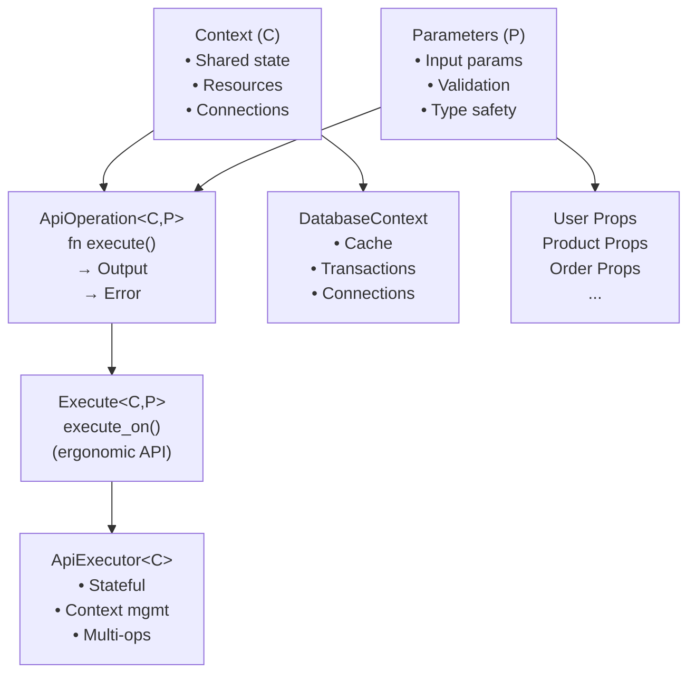

# API Thing

A standardized API approach based on content and prop traits.

[](https://github.com/wballard/apithing/actions)
[](https://github.com/wballard/apithing/actions)
[](https://crates.io/crates/apithing)
[](https://docs.rs/apithing)
[](https://github.com/wballard/apithing#license)

## Overview

ApiThing provides a trait-based framework for building consistent, type-safe APIs using shared contexts and property objects. The framework enables you to define operations that are composable, testable, and maintainable while enforcing consistent patterns across different API families.

### Key Features

- **Type-Safe Operations**: Define operations with compile-time validated inputs and outputs
- **Shared Context**: Reuse contexts (database connections, caches, etc.) across multiple operations
- **Composable Design**: Build complex workflows from simple, focused operations
- **Error Handling**: Rich, domain-specific error types with comprehensive error propagation
- **Multiple API Families**: Support different operation families that share the same context
- **Executor Pattern**: Optional ergonomic API for managing stateful operation execution

## Installation

Add this to your `Cargo.toml`:

```toml
[dependencies]
apithing = { git = "https://github.com/swissarmyhammer/apithing" }
```

## Quick Start

Read (./examples/basic_usage.rs)

## Core Architecture

ApiThing is built around several key concepts:



### Core Concepts

- **Operations**: Implement `ApiOperation<C, P>` trait with `execute()` method
- **Context**: Shared state across operations (database connections, caches, etc.)
- **Parameters**: Type-safe input parameters that define operation behavior
- **Output**: Strongly-typed results returned by operations
- **Error**: Domain-specific error types for comprehensive error handling

## Examples

The repository includes several comprehensive examples:

- **[basic_usage.rs](examples/basic_usage.rs)**: Direct operation execution patterns
- **[executor_pattern.rs](examples/executor_pattern.rs)**: Stateful executor usage
- **[advanced_patterns.rs](examples/advanced_patterns.rs)**: Complex workflows and patterns

Run examples with:

```bash
cargo run --example basic_usage
cargo run --example executor_pattern
cargo run --example advanced_patterns
```

## API Documentation

Complete API documentation is available at [docs.rs/apithing](https://docs.rs/apithing).

### Development Setup

```bash
# Clone the repository
git clone https://github.com/wballard/apithing.git
cd apithing

# Run tests
cargo test

# Run examples
cargo run --example basic_usage

# Check formatting and linting
cargo fmt --check
cargo clippy -- -D warnings

# Run security audit
cargo audit
```

## License

This project is licensed under the MIT License. See the [LICENSE](LICENSE) file for details.

---
